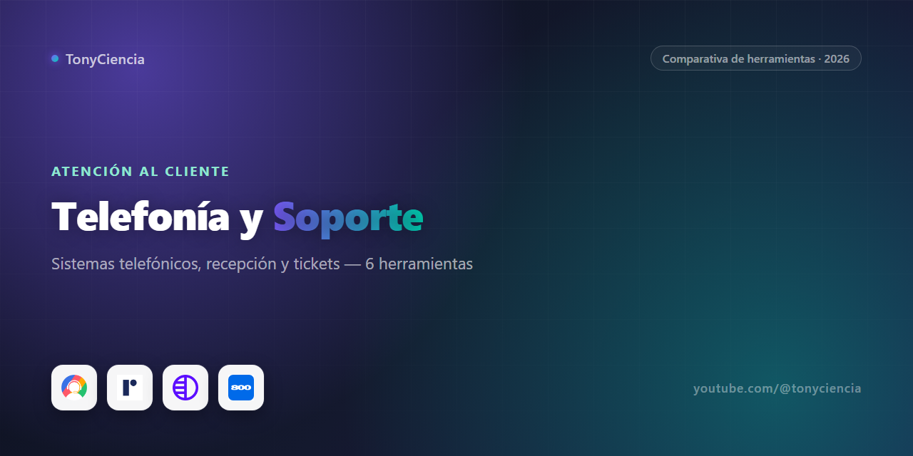

# Telefonía de negocio y atención al cliente: qué armar según tu tamaño (2026)

Contestar el teléfono, tener un número profesional, y dar soporte por ticket son tres problemas distintos, aunque casi todos los que buscan "software de telefonía" terminan mezclando los tres en la misma búsqueda. Un sistema telefónico en la nube no resuelve que nadie atienda cuando llaman fuera de horario. Y ninguna de las dos cosas tiene nada que ver con gestionar tickets de soporte B2B. Esta comparativa está separada así, por el problema real que resuelve cada herramienta, no por categoría de marketing.

## Comparativa rápida

| | Herramienta | Para qué sirve | Link |
|---|---|---|---|
|  | **800.com** | Números 1-800 y sistema telefónico virtual | [Probar →](https://try.800.com/24ifwcpxvk97) |
|  | **Answering Service Care** | Recepcionistas humanos tercerizados 24/7 | [Probar →](https://partners.answeringservicecare.com/ep2vhktayel1) |
|  | **CallHippo** | Sistema telefónico en la nube para ventas/soporte | [Probar →](https://join.callhippo.com/y8rj9iy5jqqc) |
|  | **Ruby** | Recepción telefónica y chat en vivo con personas reales | [Probar →](https://get.ruby.com/henhoycx1b8o) |
|  | **Unitel Voice** | Sistema telefónico virtual económico para pymes chicas | [Probar →](https://unitelvoice.partnerlinks.io/6ukqdgxgwxld) |
|  | **Pylon** | Soporte al cliente B2B por tickets (mesa de ayuda moderna) | [Probar →](https://pylon.partnerlinks.io/nkys1i3jit11) |

---

## Sistemas telefónicos virtuales

Acá el software te da un número, un IVR, extensiones por empleado y la posibilidad de llamar desde el celular como si fuera la línea de la oficina — pero nadie contesta por vos, eso lo sigue haciendo tu equipo. La diferencia entre las tres opciones de esta categoría es básicamente tamaño y presupuesto.

**Unitel Voice** es la opción para el negocio de una o dos personas que solo necesita dejar de usar su celular personal como número de la empresa: auto-atendedor, extensiones básicas, buzón de voz por email, precio bajo. No tiene la profundidad de un call center, pero tampoco la necesita quien recién está formalizando su primera línea de negocio.

**CallHippo** apunta a equipos de ventas y soporte que ya hacen volumen de llamadas: distribución automática de llamadas entre agentes, grabación, métricas por vendedor, integraciones con CRM. Si tu operación tiene más de un puñado de personas contestando teléfonos y necesitás saber quién atiende qué, esta es la categoría de arriba.

**800.com** resuelve algo puntual y valioso: un número 1-800 real, que en ciertos rubros (servicios profesionales, negocios que buscan sonar establecidos a nivel nacional) todavía transmite una credibilidad que un número local no da. Combina eso con funciones de sistema telefónico virtual, así que también sirve como opción intermedia entre Unitel Voice y CallHippo si lo que te importa es el número en sí.

## Recepción humana tercerizada

Esto ya no es software — es contratar personas que atienden tu teléfono como si trabajaran en tu oficina, sin que vos tengas que emplear a nadie directamente. Tiene sentido cuando perder una llamada significa perder un cliente (estudios legales, servicios a domicilio, clínicas) y no da el presupuesto —o el volumen— para justificar un recepcionista de planta.

**Ruby** y **Answering Service Care** compiten en el mismo terreno pero con acento distinto. Ruby suma chat en vivo en el sitio además del teléfono, atendido también por personas reales, no bots — útil si tu negocio recibe tanto llamadas como consultas por web y querés que ambos canales suenen igual de profesionales. Answering Service Care está más enfocado en el teléfono puro, con cobertura 24/7 y planes pensados para volumen de llamadas más alto o guardias fuera de horario (por ejemplo, negocios que necesitan alguien atendiendo a las 3 AM sin que sea tu problema personal).

## Soporte al cliente B2B por tickets

**Pylon** es la que menos se parece a todo lo anterior de esta lista, porque no tiene nada que ver con teléfono. Es una mesa de ayuda (helpdesk) pensada específicamente para empresas B2B que dan soporte a otras empresas: tickets, Slack compartido con el cliente, base de conocimiento, todo centralizado en un solo lugar en vez de que el soporte viva repartido entre Slack, email y planillas sueltas. Si tu negocio no responde por teléfono sino por tickets — típico en SaaS o servicios técnicos — esta es la categoría que te corresponde, no las anteriores.

## Cómo armamos esta comparativa

Estas seis herramientas son el stack real de partnerships que tenemos activos hoy — no se buscó completar una lista "top 10" por completitud, se armó a partir de con quién ya tenemos relación de afiliado vigente. Si un programa vence o queda pendiente de aprobación, sale de acá; no dejamos partners inactivos en la tabla solo para que se vea más larga. Por eso el criterio no es "cuál es objetivamente la mejor herramienta de telefonía del mercado" sino "de las que probamos y con las que trabajamos, cuál le sirve a qué tipo de negocio".

## Preguntas frecuentes

**¿Necesito un sistema telefónico virtual y además recepción humana, o son lo mismo?**
Son capas distintas y a veces se combinan. El sistema telefónico (CallHippo, Unitel Voice, 800.com) te da el número y la infraestructura; la recepción humana (Ruby, Answering Service Care) es quien contesta. Un negocio chico puede arrancar solo con el sistema telefónico y buzón de voz, y sumar recepción humana cuando empieza a perder llamadas importantes por no atender a tiempo.

**¿Por qué Pylon está en una comparativa de telefonía si no es teléfono?**
Porque "atención al cliente" y "telefonía" no son lo mismo, aunque se buscan juntas. Si tu soporte es por tickets y no por llamadas, un sistema telefónico no te resuelve nada — necesitás una mesa de ayuda como Pylon. Está acá porque es parte real del mismo problema más amplio: cómo tu negocio atiende a quien lo contacta.

**¿Ruby o Answering Service Care si recién estoy armando esto?**
Si tu volumen de llamadas todavía es bajo pero también recibís consultas por chat en el sitio, Ruby cubre ambos canales con el mismo equipo. Si lo que necesitás es cobertura de teléfono asegurada las 24 horas, incluyendo madrugada y fines de semana, Answering Service Care está más armado para ese volumen.

---

### Sobre este repo

Esta comparativa la mantiene [TonyCiencia](https://youtube.com/@tonyciencia). Los links de arriba son de afiliado: entrar por acá no te cuesta nada extra, pero si contratás algo ayuda a sostener el contenido del canal. Solo aparecen herramientas con las que tenemos una relación de partner activa — no es una lista pagada por posición, y no hay testimonios inventados acá adentro.

Última actualización: 2026-08.
